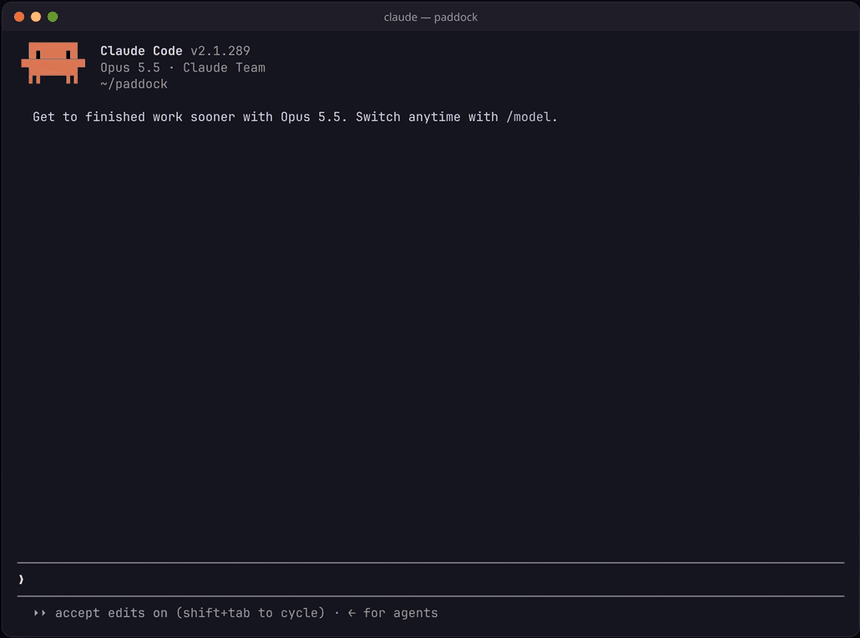

# clawd-park

A Claude Code mod that puts a pixel dinosaur park under the spinner. A coral T-rex acts out what the agent is doing, and every failing test run brings the meteor closer.



The same turn as an [MP4](docs/demo.mp4). It's the mod's own drawing code, driven through a scripted turn.

It makes no model calls and costs no tokens. Nothing leaves your machine.

## Install

In Claude Code:

```
/plugin marketplace add falkoro/clawd-park
/plugin install clawd-park@clawd-park
```

The park opens with your next turn. To try a checkout without installing it: `claude --plugin-dir plugins/clawd-park`.

## What happens in the park

Rex acts out each step of the agent's work, tagged with what it is: `[reading cart.ts]`, `[running npm test]`.

| The agent is | Rex |
| --- | --- |
| thinking | wanders about |
| reading or searching | walks to a fern and grazes |
| editing or writing | stomps on the spot |
| running a command | roars |
| on the web | wanders while a pterodactyl flies laps overhead |
| starting a subagent | lays an egg; the hatchling trails Rex until its helper is done, then walks off |

### The meteor

A test run is a Bash command such as `npm test`, `pytest`, `go test ./...` or `npx vitest run`.

- **A failing run** (a non-zero exit, or output like `2 failed` or `FAIL`) brings the meteor in. It's tagged `[tests failed 1x]`, then `[tests failed 2x]`, closer each time.
- **A passing run** breaks it up in a shower of sparks: `[tests pass]`.
- **Three failing runs in a row** bring it down. Flash, dust, and Rex is a fossil: `EXTINCTION: 3 failing test runs in a row`.

A run that never happened, because you rejected it or a hook blocked it, doesn't count either way.

The ground keeps score: `41 turns since the last extinction`. Every turn that ends without one adds to it, an extinction sets it back to 0, and the count is kept between sessions.

## Configure

- `/park` shows the count and how close the meteor is.
- `/park off` closes the park for the rest of the session, and `/park on` opens it again.
- To close it for good, turn off "Show the park" in `/plugin`.

The park draws only in the terminal. On the desktop the spinner is left alone.

## How it works

1. **Watching.** `tool.call` gives the mod each step and its result, `turn.start` and `turn.complete` the turn around them. A subagent's own turns don't end the park's.
2. **Drawing.** The Spinner render site (`ui.render` on `Spinner`) keeps the normal spinner line and adds an 8-row `Raster` below it. A 50 ms timer draws each frame and repaints the Raster in place with `$.ui.blit`.
3. **Keeping score.** The count is the one thing saved, in the mod's own `$.store`.

## Develop

```
claude plugin validate plugins/clawd-park --strict
claude plugin test plugins/clawd-park
```

The tests cover the step and verdict rules, the meteor, the drawing, and the mod against a stubbed engine: the Raster, the frame timer, the count, extinctions, `/park` and the options. CI runs the same commands.

Ideas and pull requests are welcome: a new step for Rex to act out, a new dinosaur, a bug.

## License

MIT. Rex wears the coral of Clawd, the Claude Code mascot.
